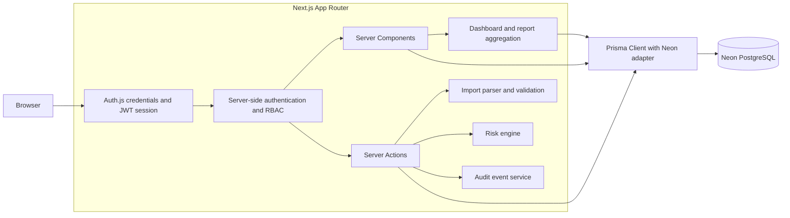
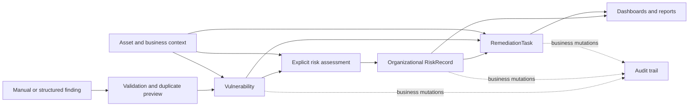

# Architecture

SecondOrder is a server-rendered Next.js application. Data access, authorization, and mutations remain on the server; browser components handle presentation and user interaction without receiving a Prisma client or database credentials.

## Application Architecture

### Request Boundaries

- The application proxy redirects unauthenticated page requests to `/login`.
- Server Components perform read-only Prisma queries after permission checks.
- Server Actions validate input and enforce permissions before mutations.
- Business mutations and their audit events share Prisma transactions where an audit trail is required.
- Pure modules implement risk calculation, remediation metrics, reporting aggregation, permissions, and import classification, which keeps those rules deterministic and testable.

## Vulnerability To Risk Workflow

Imported findings become open vulnerabilities after confirmation. They do not automatically receive a RiskRecord. A permitted user explicitly assesses the vulnerability with current technical and asset context plus business impact and data sensitivity. The resulting RiskRecord remains the official assessment until an explicit reassessment updates it.

## Data Model Summary

- Departments contain users and assets.
- Assets belong to a department, may have an owner, and contain vulnerabilities.
- A vulnerability belongs to one affected asset and may have one current RiskRecord.
- RiskRecords store assessed business inputs, the organizational score and level, and a deterministic explanation.
- RemediationTasks reference both the vulnerability and its affected asset and are assigned to a user.
- AuditEvents record who performed a supported action against an entity.

The direct asset reference on remediation tasks is validated against the selected vulnerability during writes. This supports efficient operational reporting without allowing inconsistent relationships.

## Reporting

Dashboard and report pages load current database state through a shared server-side reporting query. Pure aggregation helpers then shape role-specific summaries. The v1 schema does not store periodic snapshots, so the application presents current-state distributions and rankings rather than fabricated historical trends.
